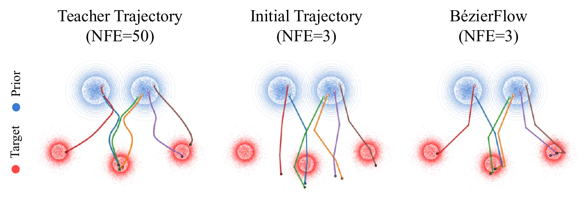

<h2>BézierFlow: Learning Bézier Stochastic Interpolant Schedulers for Few-Step Generation</h2>

[**Yunhong Min**](https://myh4832.github.io)* · [**Juil Koo**](https://63days.github.io)* · [**Seungwoo Yoo**](https://dvelopery0115.github.io) · [**Minhyuk Sung**](https://mhsung.github.io) (* Equal Contribution)

KAIST

<b>arXiv 2025</b>

## TL;DR
We introduce BézierFlow, a lightweight training approach for few-step generation with pretrained diffusion and flow models. BézierFlow achieves a 2–3× performance improvement for sampling with ≤ 10 NFEs while requiring only 15 minutes of training.

### Code - To be released!

